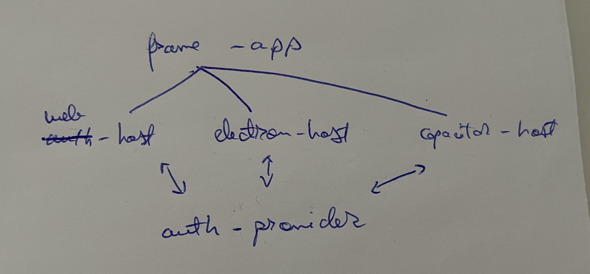

# Circles Frame App

## How it works?

The `web-host` || `electron-host` || `capacitor-host` apps will require the `@circlesland/frame-app` as a dependency and build together the full production app. All the host specific APIs will be injected into the `window` object.

All the shared logic & platform agnostic code will be here in the `@circlesland/frame-app`. The main purpose of the host apps is to implement the native APIs (example use localStorage on web, UserDefaults on iOS and SharedPreferences on Android, etc).

All apps (web, electron, capacitor) will open the `auth-provider` for authentication on the native web browser. After the use completes the auth process in the web browser, it will be redirected back to the app (web for the web version, open the mobile app for capacitor or open the desktop app for electron).

## Getting Started

1. Clone this repository locally
2. Clone any host app locally - [web-host](https://github.com/circlesland/web-host), [electron-host](https://github.com/circlesland/electron-host), [capacitor-host](https://github.com/circlesland/capacitor-host)
3. Run `npm install` into the host app
4. Run `npm link` into the frame app
5. Run `npm link @circlesland/frame-app` into the host app
6. Run `npm run dev` (or `npm run dev:ios`) into the host app 🎉
7. Clone [auth-provider](https://github.com/circlesland/auth-provider) locally and run `npm install` & `npm start`

## Resources

- https://github.com/codechips/svelte-typescript-setups/blob/master/svelte-webpack5-typescript/package.json

### Web3Auth

- https://web3auth.io/docs/quick-start?lang=html&chain=eth&customAuthentication=no&whitelabel=no&customLogin=no#step-1

### Electron

- https://www.electronjs.org/docs/latest/tutorial/launch-app-from-url-in-another-app#electron-forge
- https://dev.to/olyno/how-to-create-an-electron-application-with-vite-im

### Capacitor

- https://capacitorjs.com/solution/svelte
